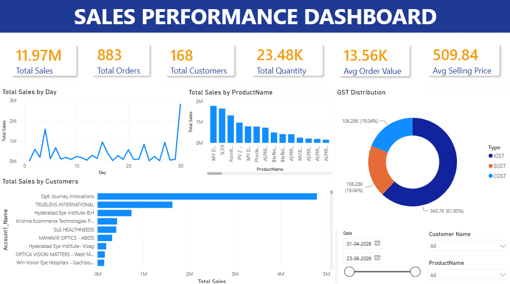
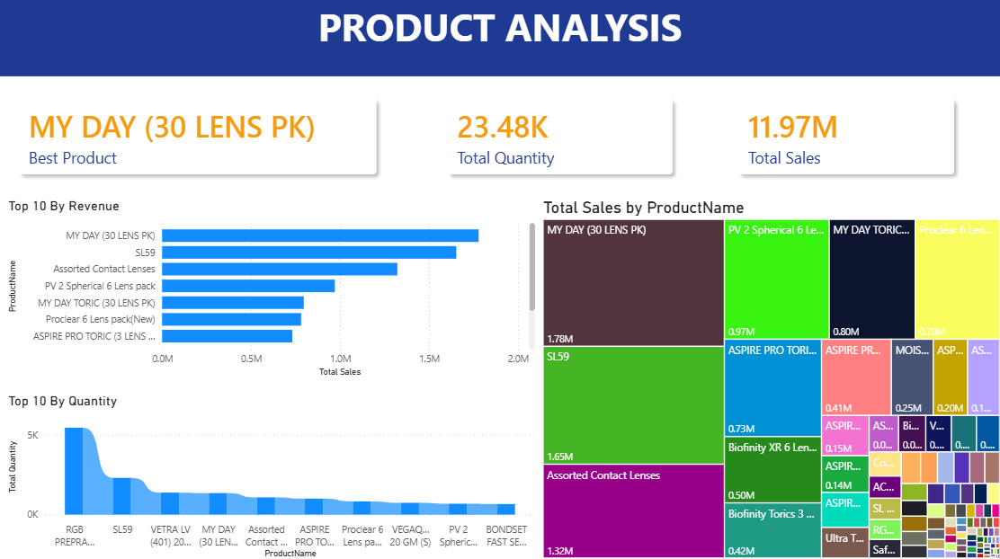

# 📊 Sales Performance Analytics Dashboard

An interactive **Power BI dashboard** built to analyze sales performance, customer behavior, product performance, and GST analytics. This project demonstrates data visualization, business intelligence, and DAX capabilities using a real-world sales dataset.

---

## 📌 Project Overview

Businesses generate thousands of sales transactions every day, making it difficult to identify trends and make informed decisions. This dashboard provides an executive view of key sales metrics, enabling stakeholders to monitor performance, identify top-performing products and customers, and analyze tax distribution.

The dashboard was developed using **Power BI**, **DAX**, and **Microsoft Excel**, with a focus on creating a clean, interactive, and business-ready reporting solution.

---

## 🎯 Objectives

- Monitor overall sales performance
- Analyze customer purchasing behavior
- Identify top-performing products
- Track GST collection
- Provide interactive filtering for business users
- Build an executive-level dashboard suitable for business decision-making

---

# 🛠️ Tech Stack

| Tool | Purpose |
|------|---------|
| Microsoft Power BI | Dashboard Development |
| DAX | KPI Calculations & Business Logic |
| Power Query | Data Cleaning & Transformation |
| Microsoft Excel | Data Source |

---

# 📁 Dataset

The dataset contains transactional sales information including:

- Invoice Date
- Invoice Number
- Customer Name
- Product Name
- Quantity Sold
- Unit Price
- Invoice Amount
- Taxable Amount
- SGST
- CGST
- IGST
- GST Type

---

# 📈 Dashboard Pages

## 1️⃣ Executive Dashboard

Provides a high-level overview of business performance.

### KPIs

- Total Sales
- Total Orders
- Total Customers
- Total Quantity Sold
- Average Order Value
- Average Selling Price
- Product Count
- Total Tax Collected

### Visualizations

- Sales Trend
- Top Products by Revenue
- Top Customers by Revenue
- GST Distribution
- Interactive Filters

---

## 2️⃣ Customer Analysis

Focuses on customer purchasing patterns.

### Includes

- Top Customers
- Customer Revenue Contribution
- Customer Purchase Frequency
- Customer-wise Sales Analysis

---

## 3️⃣ Product Analysis

Analyzes product performance.

### Includes

- Best Selling Product
- Product Count
- Total Quantity Sold
- Top Products by Revenue
- Top Products by Quantity
- Product Contribution Treemap
- Pareto Analysis (80/20 Rule)

---

# 📊 Key Features

✅ Interactive Slicers

✅ Executive KPI Cards

✅ Dynamic DAX Measures

✅ Drill-through Analysis

✅ Product Performance Insights

✅ Customer Analytics

✅ GST Distribution Analysis

✅ Multi-page Dashboard

---

# 🧮 DAX Measures Used

Some of the major DAX measures include:

- Total Sales
- Total Orders
- Total Customers
- Total Quantity
- Average Order Value
- Average Selling Price
- Product Count
- Tax Collected
- Best Product
- Product Rank
- Cumulative Sales
- Cumulative Sales %

---

# 📷 Dashboard Preview

## Executive Dashboard



---

## Customer Analysis


---

## Product Analysis



---

# 💡 Business Insights

The dashboard enables users to:

- Identify the highest revenue-generating products
- Analyze customer purchasing trends
- Track GST collections
- Monitor daily sales performance
- Detect top revenue-contributing customers
- Understand product contribution using Pareto Analysis
- Improve business decision-making through interactive visualizations

---

# 📂 Project Structure

```
Sales-Performance-Dashboard
│
├── Dashboard
│   └── Sales Performance Dashboard.pbix
│
├── Data
│   └── Sales Data.xlsx
│
├── Images
│   ├── ExecutiveDashboard.png
│   ├── CustomerAnalysis.png
│   └── ProductAnalysis.png
│
├── Documentation
│   └── Project Report.pdf
│
└── README.md
```

---

# 🚀 How to Use

1. Clone this repository

```bash
git clone https://github.com/yourusername/Sales-Performance-Dashboard.git
```

2. Open the `.pbix` file using **Power BI Desktop**.

3. Refresh the dataset if required.

4. Explore the dashboard using the interactive slicers and filters.

---

# 📌 Future Improvements

- Sales Forecasting using Time Series Analysis
- Customer Segmentation
- Profit Margin Analysis
- Inventory Dashboard
- Regional Sales Analysis
- Row-Level Security (RLS)
- Power BI Service Deployment
- Automated Data Refresh

---

# 👨‍💻 Author

**Pooshan Goud**

B.Tech – Computer Science (Data Science)

GitHub: https://github.com/yourusername

LinkedIn: https://linkedin.com/in/yourusername

---

# ⭐ If you found this project useful, consider giving it a star.